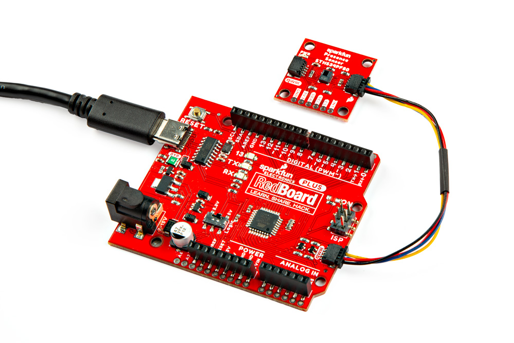
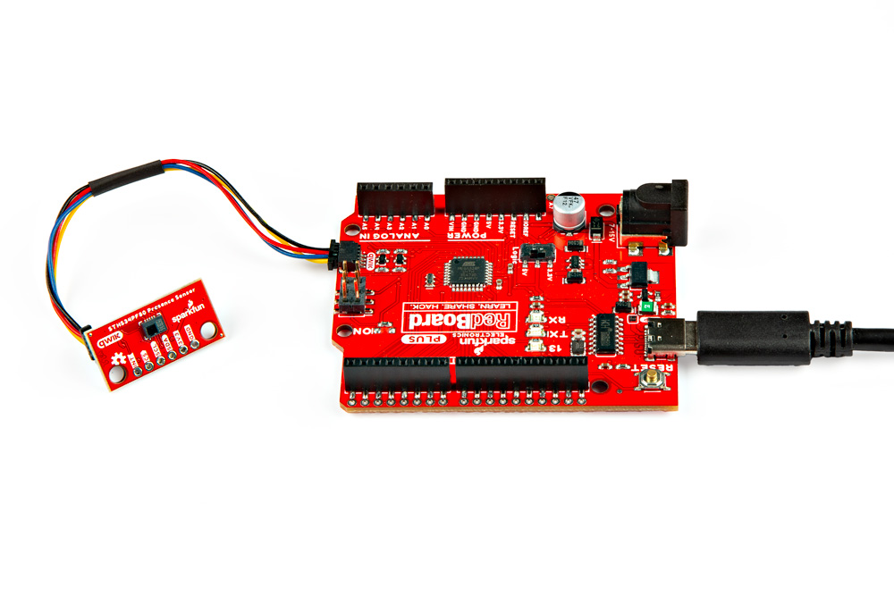
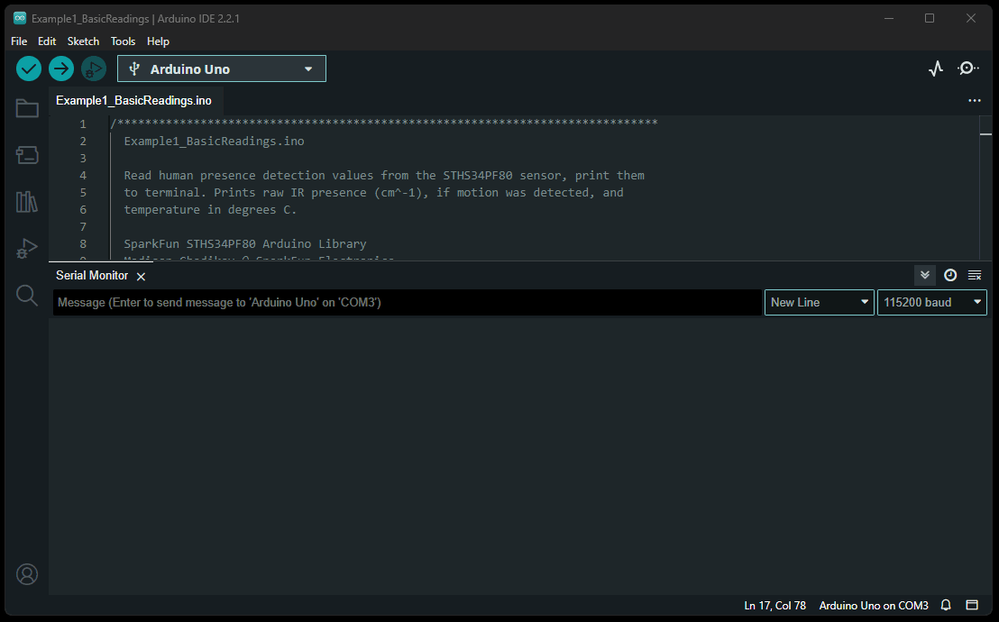

## Description
Once the [Arduino library has been installed](../software_overview/#sparkfun-sths34pf80-arduino-library), the [`Example1_BasicReadings.ino`](https://github.com/sparkfun/SparkFun_STHS34PF80_Arduino_Library/blob/main/examples/Example1_BasicReadings) example file can be accessed from the **File** > **Examples** > **SparkFun STHS34PF80 Arduino Library** > **Example1_BasicReadings** drop-down menu. This example reads the human presence detection values from the STHS34PF80 sensor through the I<sup>2</sup>C interface and displays them in the [Serial Monitor](https://learn.sparkfun.com/tutorials/112).

??? code "`Example1_BasicReadings.ino`"
	??? info "Code Verification"
		This code was last verified to be functional under the following parameters:

			--8<-- "https://raw.githubusercontent.com/sparkfun/SparkFun_STHS34PF80_Arduino_Library/main/examples/Example1_BasicReadings/Example1_BasicReadings.ino:15:18"

	```  c++ linenums="1"
	--8<-- "https://raw.githubusercontent.com/sparkfun/SparkFun_STHS34PF80_Arduino_Library/main/examples/Example1_BasicReadings/Example1_BasicReadings.ino"
	```


## Hardware Connections
For this example, users simply need to connect their Qwiic Human Presence/Motion Sensor board to their microcontroller, utilizing the I<sup>2</sup>C interface. With the recommended hardware, users can easily connect their boards with the Qwiic connection system.

<div class="grid" markdown>

<div markdown>
<figure markdown>
[{ width="400" }](./assets/img/hookup_guide/example-basic-1x1.jpg "Click to enlarge")
</figure>
</div>

<div markdown>
<figure markdown>
[{ width="400" }](./assets/img/hookup_guide/example-basic-mini.jpg "Click to enlarge")
</figure>
</div>

</div>

<center>
*The Qwiic Human Presence/Motion Sensor boards are connected to a RedBoard Plus, with a [Qwiic cable](https://www.sparkfun.com/products/15081).*
</center>

??? info "Pin Connections"
	For users with a development board without a Qwiic connector, the table below illustrates the required pin connections. Make sure that the logic-level of the sensor is compatible with the development board that is being connected.

	<center>

	| Sensor Pin | Microcontroller Pin | RedBoard/Uno |
	| :--------: | :------------------ | :----------: |
	| `SCL` | I<sup>2</sup>C - Serial Clock | `SCL`/`A5` |
	| `SDA` | I<sup>2</sup>C - Serial Data  | `SDA`/`A4` |
	| `3V3` | Power: **1.7 to 3.6V**        | `3.3V`     |
	| `GND` | Ground                        | `GND`      |

	</center>

## Serial Monitor
This example reads the human presence detection values from the STHS34PF80 sensor and displays them in the [Serial Monitor](https://learn.sparkfun.com/tutorials/112). It prints the raw IR presence (cm<sup>-1</sup>), if the motion detection flag was triggered, and temperature (&deg;C).

<figure markdown>
[{ width="400" }](./assets/img/hookup_guide/example-basic.gif "Click to enlarge")
<figcaption markdown>
The human presence detection values being streamed from the STHS34PF80 sensor into the [Serial Monitor](https://learn.sparkfun.com/tutorials/112).
</figcaption>
</figure>

!!! tip
	For this example wave different objects in front of the sensor, with varying ranges. Objects that emit black body radiation work the best and should trigger the motion detected flag.
