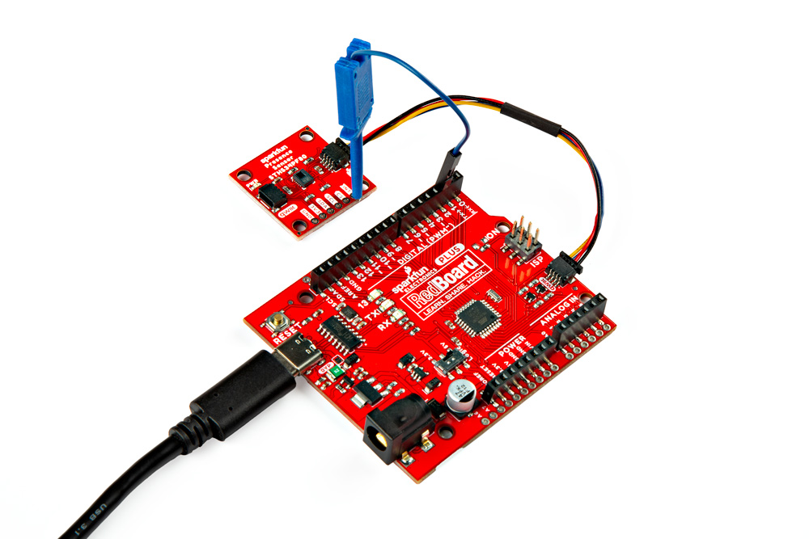
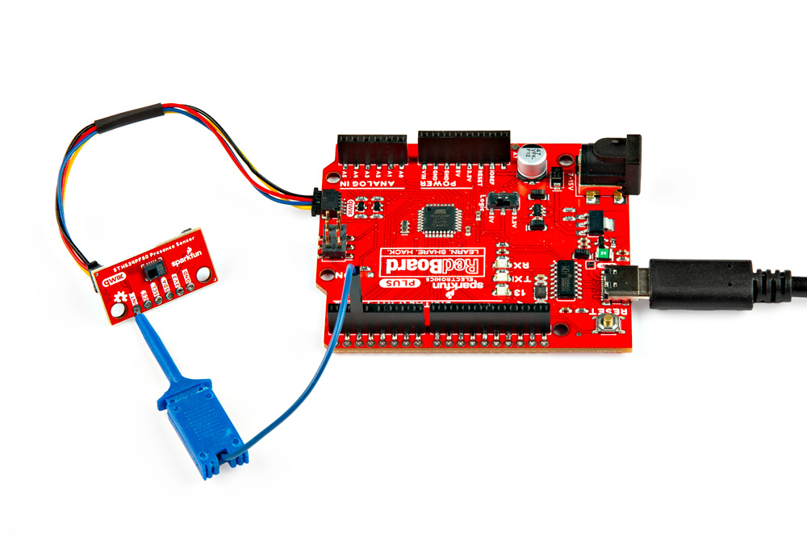
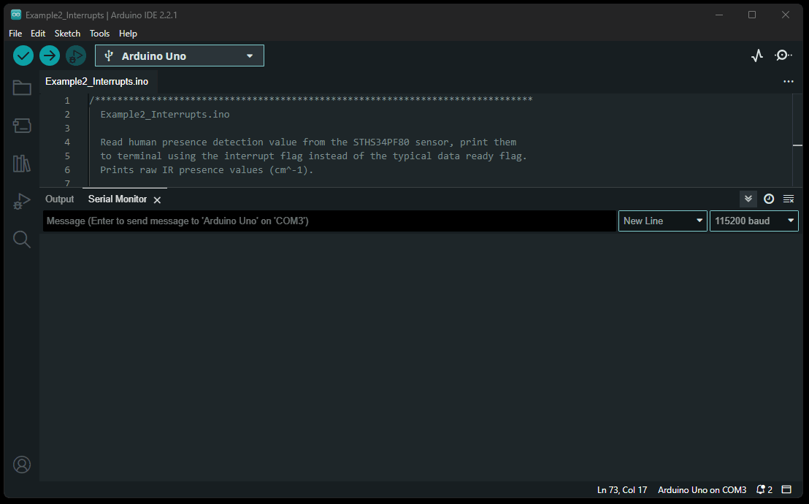

## Description
The [`Example2_Interrupts.ino`](https://github.com/sparkfun/SparkFun_STHS34PF80_Arduino_Library/blob/main/examples/Example2_Interrupts) example file can be accessed from the **File** > **Examples** > **SparkFun STHS34PF80 Arduino Library** > **Example2_Interrupts** drop-down menu. This example builds upon the previous code in [`Example1_BasicReadings.ino`](https://github.com/sparkfun/SparkFun_STHS34PF80_Arduino_Library/blob/main/examples/Example1_BasicReadings). Instead of constantly streaming the human presence detection values from the STHS34PF80 sensor, the microcontroller waits until an interrupt is triggered before data is retrieved through the I<sup>2</sup>C interface.

??? code "`Example2_Interrupts.ino`"
	??? info "Code Verification"
		This code was last verified to be functional under the following parameters:

			--8<-- "https://raw.githubusercontent.com/sparkfun/SparkFun_STHS34PF80_Arduino_Library/main/examples/Example2_Interrupts/Example2_Interrupts.ino:15:18"

	```  c++ linenums="1"
	--8<-- "https://raw.githubusercontent.com/sparkfun/SparkFun_STHS34PF80_Arduino_Library/main/examples/Example2_Interrupts/Example2_Interrupts.ino"
	```


## Hardware Connections
For this example, users simply need to connect their Qwiic Human Presence/Motion Sensor board to their microcontroller, utilizing the I<sup>2</sup>C interface and interrupt pin. Users can easily connect the I<sup>2</sup>C interface with the Qwiic connection system on their boards. To connect the interrupt pin, we recommend utilizing an [IC-hook](https://www.sparkfun.com/products/9741) for a temporary connection.

<div class="grid" markdown>

<div markdown>
<figure markdown>
[{ width="400" }](./assets/img/hookup_guide/example-interrupt-1x1.jpg "Click to enlarge")
</figure>
</div>

<div markdown>
<figure markdown>
[{ width="400" }](./assets/img/hookup_guide/example-interrupt-mini.jpg "Click to enlarge")
</figure>
</div>

</div>

<center>
*The Qwiic Human Presence/Motion Sensor boards are connected to a RedBoard Plus, with a [Qwiic cable](https://www.sparkfun.com/products/15081) and an [IC-hook](https://www.sparkfun.com/products/9741).*
</center>

??? info "Pin Connections"
	For users with a development board without a Qwiic connector, the table below illustrates the required pin connections. Make sure that the logic-level of the sensor is compatible with the development board that is being connected.

	<center>

	| Sensor Pin | Microcontroller Pin | RedBoard/Uno |
	| :--------: | :------------------ | :----------: |
	| `INT` | Interrupt Pin                 | `D2`       |
	| `SCL` | I<sup>2</sup>C - Serial Clock | `SCL`/`A5` |
	| `SDA` | I<sup>2</sup>C - Serial Data  | `SDA`/`A4` |
	| `3V3` | Power: **1.7 to 3.6V**        | `3.3V`     |
	| `GND` | Ground                        | `GND`      |

	</center>

## Serial Monitor
This example waits until an interrupt is triggered by one of the detection modes before the raw IR presence value (cm<sup>-1</sup>) is retrieved from the STHS34PF80 sensor. The data is then displayed in the [Serial Monitor](https://learn.sparkfun.com/tutorials/112).

<figure markdown>
[{ width="400" }](./assets/img/hookup_guide/example-interrupt.gif "Click to enlarge")
<figcaption markdown>
The human presence detection values being streamed from the STHS34PF80 sensor into the [Serial Monitor](https://learn.sparkfun.com/tutorials/112).
</figcaption>
</figure>

!!! tip
	For this example wave different objects in front of the sensor, with varying ranges in and out of the sensor's field of view. Objects that emit black body radiation work the best and should trigger the interrupt.
