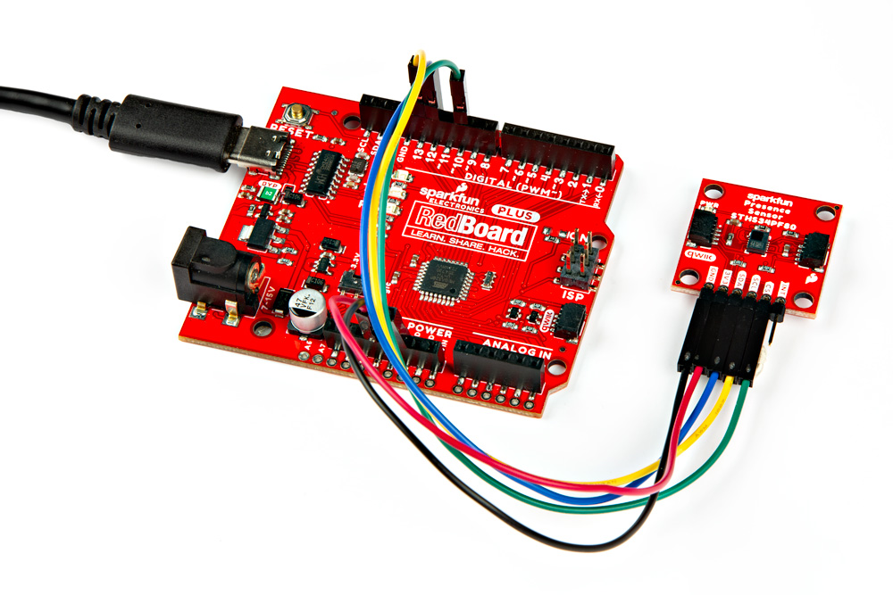
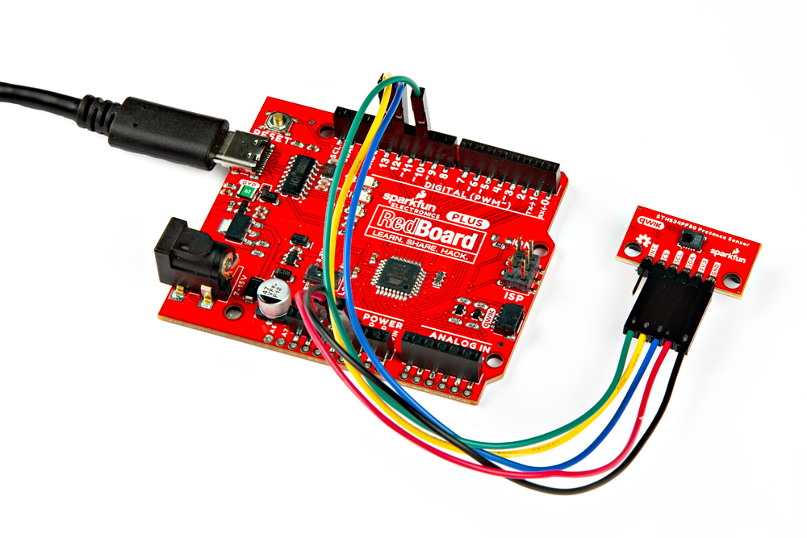

## Description
The [`Example4_SPIFunctionality.ino`](https://github.com/sparkfun/SparkFun_STHS34PF80_Arduino_Library/blob/main/examples/Example4_SPIFunctionality) example file can be accessed from the **File** > **Examples** > **SparkFun STHS34PF80 Arduino Library** > **Example4_SPIFunctionality** drop-down menu. This example operates similarly to the code in [`Example1_BasicReadings.ino`](https://github.com/sparkfun/SparkFun_STHS34PF80_Arduino_Library/blob/main/examples/Example1_BasicReadings). Instead of retrieving data through the I<sup>2</sup>C interface, the serial peripheral interface (SPI) is used to access the human presence detection values from the STHS34PF80 sensor.

??? code "`Example4_SPIFunctionality.ino`"
	??? info "Code Verification"
		This code was last verified to be functional under the following parameters:

			--8<-- "https://raw.githubusercontent.com/sparkfun/SparkFun_STHS34PF80_Arduino_Library/main/examples/Example4_SPIFunctionality/Example4_SPIFunctionality.ino:16:19"

	```  c++ linenums="1"
	--8<-- "https://raw.githubusercontent.com/sparkfun/SparkFun_STHS34PF80_Arduino_Library/main/examples/Example4_SPIFunctionality/Example4_SPIFunctionality.ino"
	```


## Hardware Connections
For this example, users will need to modify the `CS` jumper to enable the [SPI](https://en.wikipedia.org/wiki/Serial_Peripheral_Interface "Serial Peripheral Interface") communication. In the setups illustrated below, [right-angle headers](https://www.sparkfun.com/products/553) were soldered to the boards and connected with [M/F jumper wires](https://www.sparkfun.com/products/9140) to the microcontroller. However, users should select a connection method that suits their needs.

<div class="grid" markdown>

<div markdown>
<figure markdown>
[{ width="400" }](./assets/img/hookup_guide/example-spi-1x1.jpg "Click to enlarge")
</figure>
</div>

<div markdown>
<figure markdown>
[{ width="400" }](./assets/img/hookup_guide/example-spi-mini.jpg "Click to enlarge")
</figure>
</div>

</div>

<center>
*The Qwiic Human Presence/Motion Sensor boards with [headers](https://www.sparkfun.com/products/553) soldered to them and connected to a RedBoard Plus with [jumper wires](https://www.sparkfun.com/products/9140).*
</center>

### Pin Connections
Below are the pin connections for SPI communication with the sensor. Users should be aware of the logic-levels of their microcontroller; with the [RedBoard Plus](https://www.sparkfun.com/products/18158), users only need to flip a switch to configure all the board's pins to **3.3V-logic**.

<div class="grid" markdown>

<div align="center" markdown>

| Sensor Pin | Microcontroller Pin | RedBoard Plus |
| :--------: | :------------------ | :----------: |
| `CS`  | SPI - Chip Select Pin         | `10`    |
| `SCL` | SPI - Serial Peripheral Clock | `13`    |
| `SDA` | SPI - Serial Data In/Out      | `12`    |
| `3V3` | Power: **1.7 to 3.6V**        | `3.3V`  |
| `GND` | Ground                        | `GND`   |

</div>

<div markdown>
<figure markdown>
[{ width="350" }](https://cdn.sparkfun.com/assets/learn_tutorials/1/7/5/8/18158-SparkFun_RedBoard_Plus_IO_Logic_Switch.jpg "Click to enlarge")
<figcaption markdown>
The logic-level switch on the RedBoard Plus.
</figcaption>
</figure>
</div>

</div>

!!! note
	Users will need to initially pull the `CS` pin low, to enable the [SPI](https://en.wikipedia.org/wiki/Serial_Peripheral_Interface "Serial Peripheral Interface") communication on the Qwiic Human Presence/Motion Sensor boards.
