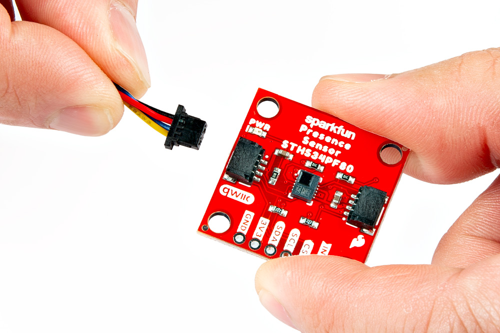
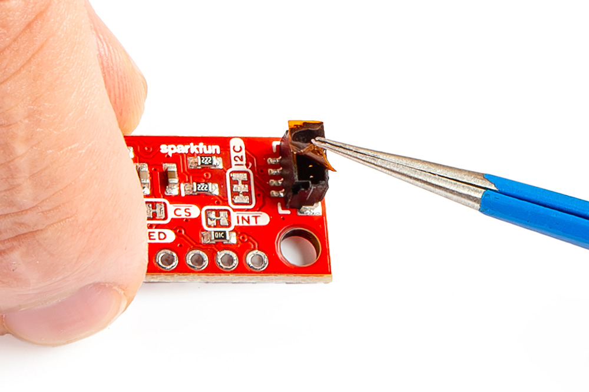
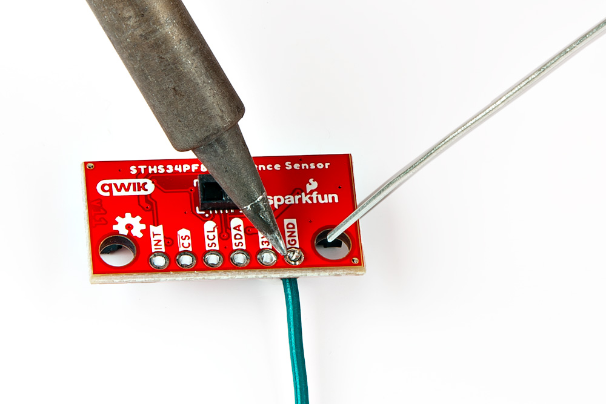
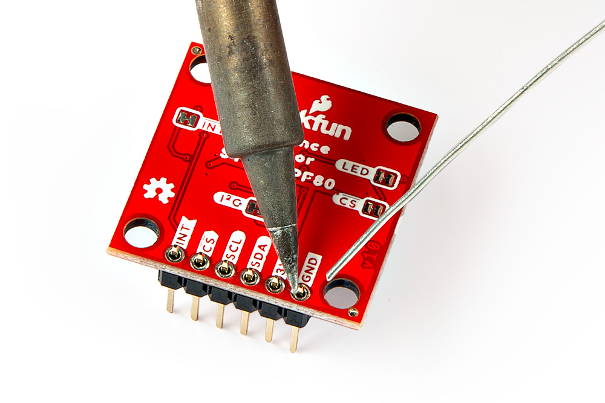

## Qwiic Cable
The simplest method to connect a microcontroller to a Qwiic Human Presence/Motion Sensor board is through the Qwiic connector.

<figure markdown>
[{ width="400" }](./assets/img/hookup_guide/assembly-qwiic.jpg "Click to enlarge")
<figcaption markdown>Connecting a [Qwiic cable](https://www.sparkfun.com/products/15081) to the Qwiic Human Presence/Motion Sensor board.</figcaption>
</figure>

!!! info
	The [Qwiic connection system](https://www.sparkfun.com/qwiic) is a standardized solderless, polarized connector interface that allows users to seamlessly daisy chain I2C boards together.

??? tip "Remove Tape"
	Users with the mini version of the Qwiic Human Presence/Motion Sensor board should remove the tape covering the Qwiic connector.

	<figure markdown>
	[{ width="400" }](./assets/img/hookup_guide/assembly-qwiic_tape.jpg "Click to enlarge")
	<figcaption markdown>Removing the tape from the Qwiic connector to the Qwiic Mini Human Presence/Motion Sensor board.</figcaption>
	</figure>

	!!! note
		The tweezers are not necessary, they were only used for illustration purposes. *(Fingers would have obscured the camera shot.)*

	!!! info
		The tape is used by the [pick-and-place machine](https://en.wikipedia.org/wiki/Pick-and-place_machine) to place the connector on the board during assembly.

## Breakout Pins
The [PTH](https://en.wikipedia.org/wiki/Through-hole_technology "Plated Through Holes") pins on the Qwiic Human Presence/Motion Sensor board are broken out into 0.1"-spaced pins on the outer edge of the board.

??? note "New to soldering?"
	If you have never soldered before or need a quick refresher, check out our [How to Solder: Through-Hole Soldering](https://learn.sparkfun.com/tutorials/how-to-solder-through-hole-soldering) guide.

	

	-   <a href="https://learn.sparkfun.com/tutorials/5">
		<figure markdown>
		
		</figure>

		---
		
		**How to Solder: Through-Hole Soldering**</a>

	

### Hookup Wires
For a more permanent connection, users can solder wires directly to the board.

<figure markdown>
[{ width="400" }](./assets/img/hookup_guide/assembly-wires.jpg "Click to enlarge")
<figcaption markdown>Soldering wires to the Qwiic Mini Human Presence/Motion Sensor board.</figcaption>
</figure>

### Headers
When [selecting headers](https://www.sparkfun.com/categories/381), be sure you are aware of the functionality or physical arrangement required.

<figure markdown>
[{ width="400" }](./assets/img/hookup_guide/assembly-headers.jpg "Click to enlarge")
<figcaption markdown>Soldering [headers](https://www.sparkfun.com/products/116) to the Qwiic Human Presence/Motion Sensor board.</figcaption>
</figure>
