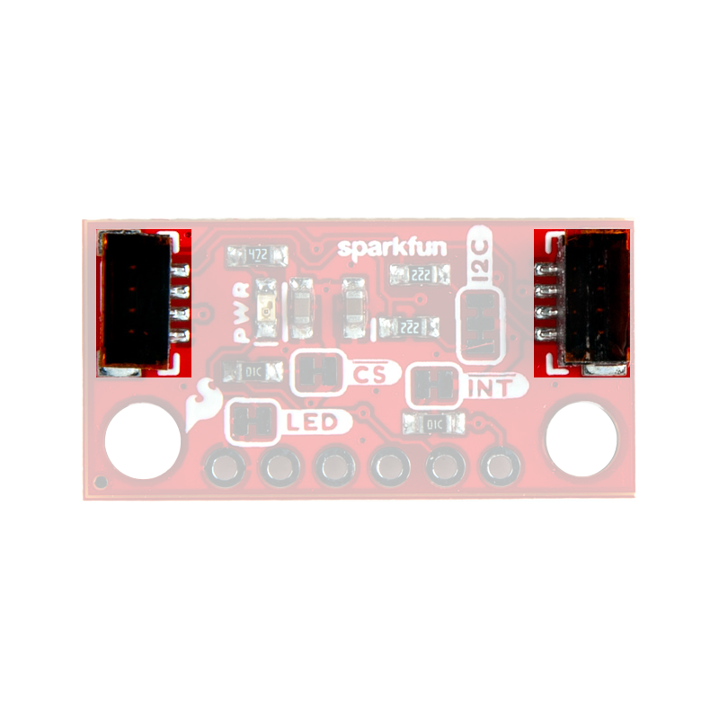

## Board Dimensions
The Qwiic Mini Human Presence and Motion Sensor breakout boards are laid out in the standardized 0.5"x 1" (1.77 x 2.54 cm) *mini* form-factor and the normal, 1" x 1" (2.54 x 2.54 cm) Qwiic breakout board. These boards also include standard 0.13" mounting holes, which are compatible with 4-40 screws. The dimensions of these boards are illustrated in the drawings below, where the listed measurements are in inches.

<figure markdown>
[{ width="280" }](./assets/img/hookup_guide/dimensions-1x1.png "Click to enlarge")
</figure>

<figure markdown>
[{ width="400" }](./assets/img/hookup_guide/dimensions-mini.png "Click to enlarge")
</figure>

*[Dimensions (PDF)](./assets/board_files/dimensions.pdf) for the Qwiic Human Presence/Motion Sensor boards, in inches.*

??? tip "Need more measurements?"
	For more information about the board's dimensions, users can download the [eagle files](./assets/board_files/eagle_files.zip) for the board. These files can be opened in Eagle and additional measurements can be made with the dimensions tool.

	??? info ":octicons-download-16:{ .heart } Eagle - Free Download!"
		Eagle is a [CAD]("computer-aided design") program for electronics that is free to use for hobbyists and students. However, it does require an account registration to utilize the software.

		

		[Download from :autodesk-primary:{ .autodesk }](https://www.autodesk.com/products/eagle/free-download "Go to downloads page"){ .md-button .md-button--primary width="250px" }
		

	??? info ":straight_ruler: Dimensions Tool"
		This video from Autodesk demonstrates how to utilize the dimensions tool in Eagle, to include additional measurements:

		

		

		<iframe src="https://www.youtube.com/embed/dZLNd1FtNB8" title="EAGLE Dimension Tool" frameborder="0" allow="accelerometer; autoplay; clipboard-write; encrypted-media; gyroscope; picture-in-picture" allowfullscreen></iframe>
		

		{ .qr }
		

## Power
The STHS34PF80 requires a supply voltage between **1.7V** to **3.6V**. This power can be provided to the board, either, through one of the *polarized* Qwiic connectors or the dedicated 3.3V and GND [PTH](https://en.wikipedia.org/wiki/Through-hole_technology "Plated Through Holes") pins broken out on the board.

<figure markdown>
[{ width="400" }](./assets/img/hookup_guide/power_connections2-1x1.png "Click to enlarge")
</figure>

<figure markdown>
[{ width="400" }](./assets/img/hookup_guide/power_connections2-mini.png "Click to enlarge")
</figure>

*Qwiic Human Presence/Motion Sensor boards' power connections.*

!!! warning "Info"
	The Qwiic connect system is meant to run on **3.3V**. Ensure that another voltage is not being supplied, when utilized in conjunction with this system.

!!! info
	For more details, users can reference the [schematic](./assets/board_files/schematic.pdf) and the [STHS34PF80 datasheet](./assets/component_documentation/sths34pf80.pdf).

### Power Status LED
The red, `PWR` LED will light up once **1.4V** is supplied to the board; however, for most users, it will light up when **3.3V** is supplied through the Qwiic connector. A jumper is available to disconnect the power from the LED, for low-power applications (see Jumpers section below).

<figure markdown>
[{ width="400" }](./assets/img/hookup_guide/LED-power-1x1.png "Click to enlarge")
</figure>

<figure markdown>
[{ width="400" }](./assets/img/hookup_guide/LED-power-mini.png "Click to enlarge")
</figure>

*The `PWR` status LED on the Qwiic Human Presence/Motion Sensor boards.*

!!! tip "Minimum Voltage"
	Users should keep in mind that the forward voltage of the red LED is lower than the minimum voltage required to power the STHS34PF80 sensor. Therefore, the LED could potentially be lit, when there isn't enough voltage to power the sensor.

## :fontawesome-solid-microchip:&nbsp; STHS34PF80
The Qwiic Human Presence/Motion Sensor board features the [STHS34PF80 sensor](./assets/component_documentation/sths34pf80.pdf) from [ST Microelectronics](https://www.st.com). Composed of a matrix of floating vacuum thermal transistors MOS, the sensor measures the ambient temperature and detects the [black-body radiation](https://en.wikipedia.org/wiki/Black-body_radiation) of objects within its 80&deg field of view. The sensor's transistor array is split into two parts, one exposed to IR radiation and the other one shielded. The differential reading between the segments, allows the sensor to remove self-heating effects.

The sensor can operate in multiple lighting conditions and is unaffected by visible light or other bands thanks to the 5 to 20&micro;m optical band-pass filter. The STHS34PF80 also incorporates algorithms to detect and discriminate between stationary and moving objects. These features enable the sensor to work as a human presence and motion sensor in different applications such as alarm systems, anti-intruder systems, smart lighting, and room occupancy. With an output data rates between 0.25 to 30 Hz and an available single-shot measurement from the STHS34PF80, all of which can be accessed through its I2C/SPI interface.

**Features:**

* I2C Address *(7-bit)*: **0x5A** *(**`1011010`**)*
* Operating Voltage: **1.7 to 3.6V**
	* Current Draw: 10&micro;A
* Range: 4m *(objects 70 x 25 cm² in size)*
	* Field of View: 80°
* Optical wavelength: 5 to 20&micro;m
* Built-in Detection Algorithms:
	* Identify stationary objects
	* Distinguish between stationary and moving objects
* Output Data Rate: 0.25 to 30Hz
* IR sensitivity: 2000 LSB/&deg;C
* RMS noise: 25 LSBrms
* Operating Temperature: -40 to 85&deg;C (1)
* Sensor accuracy: ±0.6&deg;C *(local)* (2)
* Factory calibrated

1. The operational temperature range of the sensor is 
2. The accuracy specifications only apply under settled isothermal conditions.

!!! info "Current Consumption"
	The average current consumption by the STHS34PF80 is 10&micro;A with 1.5&micro;A in power-down mode.

<!-- <figure markdown>
[{ width="400" }](./assets/img/hookup_guide/STHS34PF80-1x1.png "Click to enlarge")
 
<figure markdown>
[{ width="400" }](./assets/img/hookup_guide/STHS34PF80-mini.png "Click to enlarge")
<figcaption markdown>The STHS34PF80 sensor on the Qwiic Human Presence/Motion Sensor boards.</figcaption>
</figure> -->

<figure markdown>
[{ width="400" }](./assets/img/hookup_guide/STHS34PF80.png "Click to enlarge")
<figcaption markdown>The STHS34PF80 sensor on the Qwiic Human Presence/Motion Sensor boards.</figcaption>
</figure>

## Breakout Pins
There are six [PTH](https://en.wikipedia.org/wiki/Through-hole_technology "Plated Through Holes") pins broken out on the Qwiic Human Presence/Motion Sensor boards. The pins are evenly spaced at 0.1" on the outer edge of the board; perfect for attaching [headers](https://www.sparkfun.com/categories/381). These pins provide access to the I2C and SPI interfaces of the STHS34PF80 sensor, including the interrupt pin.

!!! note
	The I2C interface can also be accessed through the Qwiic connectors on the board.

### I2C Pins
The I2C interface can also be accessed either through the breakout pins or the Qwiic connectors on the board. In most cases, the Qwiic connector will be the simplest method to connect the Qwiic Human Presence/Motion Sensor boards to a microcontroller. The I2C interface is **enabled by default** on the Qwiic Human Presence/Motion Sensor boards.

<figure markdown>
[{ width="400" }](./assets/img/hookup_guide/pins-i2c-1x1.png "Click to enlarge")
</figure>

<figure markdown>
[{ width="400" }](./assets/img/hookup_guide/pins-i2c-mini.png "Click to enlarge")
</figure>

*I2C pins on the Qwiic Human Presence/Motion Sensor boards.*

!!! info "Enabling the I2C Interface"
	The I2C interface is enabled by default on the Qwiic Human Presence/Motion Sensor boards. To disable the I2C interface and enable the SPI interface, users must [modify the `CS` jumper](#jumpers).

??? tip " Qwiic Connector"
	Qwiic connectors are provided for users to seamlessly integrate I2C devices with [SparkFun's Qwiic Ecosystem](https://www.sparkfun.com/qwiic).

	

	

	<figure markdown>
	[{ width="400" }](./assets/img/hookup_guide/qwiic-1x1.png "Click to enlarge")
	</figure>
	

	

	<figure markdown>
	[{ width="400" }](./assets/img/hookup_guide/qwiic-mini.png "Click to enlarge")
	</figure>
	

	

	

	*Qwiic connector and I2C pins on the Qwiic Human Presence/Motion Sensor boards.*
	

### SPI Pins
The STHS34PF80 sensor operates in a 3-wire SPI configuration. In a 3-wire mode, the data signal lines are combined into a single bidirectional data line. The data transactions are half-duplex to allow for bidirectional communication.

<table markdown>
<tr>
<th align="center">Label</th>
<th align="center">Pin</th>
<th>Function</th>
</tr>
<tr markdown>
<td align="center" markdown>`SCL`</td>
<td align="center" markdown>`SPC`</td>
<td>Clock signal</td>
</tr>
<tr markdown>
<td align="center" markdown>`SDA`</td>
<td align="center" markdown>`SDIO`</td>
<td>Serial data (In/Out)</td>
</tr>
<tr markdown>
<td align="center" style="vertical-align:middle" markdown>`CS`</td>
<td align="center" style="vertical-align:middle" markdown>`CS`</td>
<td markdown>
Chip select 
Interface selection (1)
</td>
</tr>
</table>

1. 1: I²C enabled; 0: SPI enabled

<figure markdown>
[{ width="400" }](./assets/img/hookup_guide/pins-spi-1x1.png "Click to enlarge")
</figure>

<figure markdown>
[{ width="400" }](./assets/img/hookup_guide/pins-spi-mini.png "Click to enlarge")
</figure>

*SPI pins on the Qwiic Human Presence/Motion Sensor boards. Please refer to the table above for the associated pin connections, based on the boards' labels.*

!!! info "Enabling the SPI Interface"
	The I2C interface is enabled by default on the Qwiic Human Presence/Motion Sensor boards. To disable the I2C interface and enable the SPI interface, users must [modify the `CS` jumper](#jumpers). On boot-up, the `CS` must be in a `LOW` state to enable the SPI interface.

### Interrupt Pin
By default, the interrupt pin signals when data is available. However, the detection mode employed by the sensor can also trigger an interrupt.

<figure markdown>
[{ width="400" }](./assets/img/hookup_guide/pins-interrupt-1x1.png "Click to enlarge")
</figure>

<figure markdown>
[{ width="400" }](./assets/img/hookup_guide/pins-interrupt-mini.png "Click to enlarge")
</figure>

*Interrupt pin on the Qwiic Human Presence/Motion Sensor boards.*

## Qwiic Connectors
Qwiic connectors are provided for users to seamlessly integrate with [SparkFun's Qwiic Ecosystem](https://www.sparkfun.com/qwiic). Otherwise, users can access the I2C interface through the [PTH pins broken out on the board](#i2c-interface).

<figure markdown>
[{ width="400" }](./assets/img/hookup_guide/qwiic_connectors-1x1.png "Click to enlarge")
</figure>

<figure markdown>
[{ width="400" }](./assets/img/hookup_guide/qwiic_connectors-mini.png "Click to enlarge")
</figure>

*Qwiic connectors on the Qwiic Human Presence/Motion Sensor boards.*

??? tip "What is Qwiic?"

	<!-- Qwiic Banner -->
	

	[{ width=400 }](https://www.sparkfun.com/qwiic)
	[{ width=400 }](https://www.sparkfun.com/qwiic)
	

	---

	The [Qwiic connect system](https://www.sparkfun.com/qwiic) is a solderless, polarized connection system that allows users to seamlessly daisy chain I2C boards together. Play the video below to learn more about the Qwiic connect system or click on the banner above to learn more about [Qwiic products](https://www.sparkfun.com/qwiic).
	
	
	

	

	<iframe src="https://www.youtube.com/embed/x0RDEHqFIF8" title="SparkFun's Qwiic Connect System" frameborder="0" allow="accelerometer; encrypted-media; gyroscope; picture-in-picture" allowfullscreen></iframe>

	{ .qr width=100 }
	

	

	!!! info "Features of the Qwiic System"

		=== "No Soldering"

			{ align="left" width="90" }
			{ align="left" width="90" }

			Qwiic cables (4-pin JST) plug easily from development boards to sensors, shields, accessory boards and more, making easy work of setting up a new prototype.

		=== "Polarized Connector"

			{ align="left" width="90" }
			{ align="left" width="90" }

			There's no need to worry about accidentally swapping the SDA and SCL wires on your breadboard. The Qwiic connector is polarized so you know you’ll have it wired correctly 	every time, right from the start.

			The PCB connector is part number SM04B-SRSS ([Datasheet](https://cdn.sparkfun.com/assets/parts/1/2/2/8/9/Qwiic_Connector_Datasheet.pdf)) or equivalent. The mating connector used on cables is part number SHR04V-S-B or an equivalent *(1mm pitch, 4-pin JST connector)*.

		=== "Daisy Chain-able"

			{ align="left" width="90" }
			{ align="left" width="90" }

			It’s time to leverage the power of the I2C bus! Most Qwiic boards will have two or more connectors on them, allowing multiple devices to be connected.

## Jumpers

??? note "Never modified a jumper before?"
	Check out our <a href="https://learn.sparkfun.com/tutorials/664">Jumper Pads and PCB Traces tutorial</a> for a quick introduction!

	

	-   <a href="https://learn.sparkfun.com/tutorials/664">
		<figure markdown>
		
		</figure>

		---

		**How to Work with Jumper Pads and PCB Traces**</a>

	

There are four jumpers on the back of the board that can be used to easily modify the hardware connections of the board.

* **LED** - This jumper can be used to disconnect power from the red, power LED for low-power applications.
* **I2C** - This jumper can be used to remove the pull-up resistors on the I2C bus.
* **INT** - This jumper can be used to remove the pull-up resistor from the `INT` pin.
* **CS** - This jumper can be used to remove the pull-up resistor from the `CS` pin.
	* The state of the `CS` pin on boot-up, controls whether the I2C or SPI interface is enabled. (1)

1. !!! info
	* `1`: I²C enabled
	* `0`: SPI enabled

<figure markdown>
[{ width="400" }](./assets/img/hookup_guide/jumpers-1x1.png "Click to enlarge")
<figcaption markdown>Jumpers on the back of the Qwiic Human Presence/Motion Sensor board.</figcaption>
</figure>

<figure markdown>
[{ width="400" }](./assets/img/hookup_guide/jumpers-mini.png "Click to enlarge")
<figcaption markdown>Jumpers on the Qwiic Mini Human Presence/Motion Sensor board.</figcaption>
</figure>

